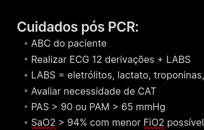

# Anestésicos locais:

## Como funcionam:

- Perineuro é a principal barreira de difusão;
- Tipos de fibras:
    - Mielinizadas:
        - Estimulo saltatório;
        - Maior velocidade de transmissão.
    - Não mielinizadas:
        - Estímulo contínuo;
        - Menor velocidade.
- Agrupamentos por tamanho ou velocidade de condução:
    - Tipo A:
        - Alfa:
            - Eferentes para músculo, motoras.
        - Beta:
            - Aferentes, propriocepção.
        - Gama:
            - Eferentes, fuso muscular, tônus.
        - Delta:
            - Aferentes, sensoriais;
            - Dor aguda e temperatura fria.
    - Tipo B:
        - Pré ganglionares simpáticas;
        - Sudorese, vasoconstrição.
    - Tipo C:
        - Única que não tem mielina;
        - Mais lentas;
        - Sensoriais, pós ganglionares;
        - Dor menos aguda;
        - Temperatura quente.
- Sobre os grupamentos:
    - Quanto menor a fibra, maior a sensibilidade ao bloqueio
    - B e C são as mais sensíveis.
- Como agem os anestésicos:
    - Bomba de Na e K mantém o gradiente;
    - Canais de sódio sensíveis a voltagem:
        - Subunidade alfa:
            - É uma proteína transmembrana;
            - É aqui onde age o anestésico local;
            - Após abertura, o canal se fecha.
    - O anestésico local atua pelo lado de dentro da célula;
    - Bloqueia os canais na conformação aberta e inativada, não atua na conformação fechada;
    - Bloqueio fásico:
        - O anestésico vai encontrar vários canais de sódio em diferentes estados;
        - Maior afinidade pelos estados inativos e abertos;
        - A despolarização repetida, aumenta a quantidade de canais de sódio abertos;
        - Então o anestésico encontra cada vez mais canais de sódio;
        - Por isso que se chama bloqueio dependente do uso.
- Teoria da expansão da membrana plasmática:
    - Benzocaína entra na membrana plasmática e fica presa lá, isso fecha o canal.

## Estrutura molecular:

- Estrutura básica:
    - Anel aromático:
        - Porção lipofílica.
    - Cadeia intermediária:
        - Pode estar ligado ao anel aromático por:
            - Éster (amino-éster):
                - NÃO TEM NITROGÊNIO.
            - Amida (amino-amida):
                - TEM NITROGÊNIO.
    - Grupo amina:
        - Hidrofílico.
- Diferenças moleculares:
  | | aminoester | aminoamida |
  | ------------------ | --------------------- | ----------- |
  | metabolismo | esterases plasmáticas | fígado p450 |
  | potencial alérgico | maior (PABA) | menor |
  | lipossolubilidade | | |
- Macete:
    - Aminoamida tem dois Is:
        - Lidocaína, Ropivacaína, Bupivacaína, Prilocaína.
- Lipossolubilidade é a propriedade mais importante!!
    - Quanto mais carbono no anel aromático, mais lipossolúvel.

## Propriedades:

- Início de ação, potência, duração e toxicidade:
    - Todas essas características estão relacionadas com a lipossolubilidade.
- Início de ação ou latência:
    - Muito relacionado ao pH e pKa;
      
    - Comparação:
        - Lidocaína (pKa 7,7) se ioniza menos que Bupi (pKa 8,1) em pH 7,4.
    - Concentração também influencia.
- Potência:
    - Quantidade de medicamento necessário para produzir determinado efeito;
    - Concentração mínima;
    - Maior lipossolubilidade = maior potência;
    - In Vivo, pode ocorrer sequestro adiposo.
- Duração:
    - Maior lipossolubilidade = maior duração;
    - Efeito vascular:
        - É bifásico:
            - Concentrações baixas fazem vasoconstrição;
            - Mais altas fazem vasodilatação (lembrar da raqui).
    - Ligação proteica:
        - Albumina é o sítio mais importante, pela quantidade circulante;
        - Maior afinidade pela alfa 1 glicoproteína ácida;
        - Maior ligação proteica = maior duração (diminui clearance);
        - Forma livre é a que atua no nervo;
        - Ex:
            - Lidocaína tem ligação 64%;
            - Bupivacaína 96%.
        - Pacientes com hipoproteinemia podem fazer intoxicação, principalmente por anestésicos com alta ligação proteica.

## Toxicidade:

- Estrita relação com potência, que também é relacionada com lipossolubilidade;
- Maior número de carbonos, maior lipossolubilidade, maior toxicidade;
- SNC:
    - Zumbido, tontura, gosto metálico, espasmo muscular, convulsões;
    - AL bloqueia zonas inibitórias:
        - Em altas doses bloqueia as excitatórias também.
    - Pela inibição excitatória, pode fazer acidose metabólica e aumento de pCO2;
        - Vasodilatação cerebral e mais entrega de AL;
        - Aprisionamento iônico.
        - Aumenta fração livre.
- Cardiovascular:
    - Pode ser direta (no coração) ou indireta (relacionada ao SNC);
    - Direta:
        - Bloqueio de canais de Na;
        - Retardam a condução do estímulo cardíaco;
            - Alargamento de intervalo PR e QRS.
        - Ligam durante sístole e desligam durante diástole:
          
            - Lembra que bloqueia canais abertos e inativados.
        - Exemplo:
            - Lidocaína tem fast in (entra rápido), mas também sai rápido, e dá tempo de se desligar;
            - Bupivacaína tem fast in e slow out, então acaba acumulando nos ciclos:
                - Afinidade maior pelos canais de sódio.
            - Taquicardia piora tudo:
                - Diminui tempo de diástole (canal fechado), que é quando o AL se desprende do canal.
        - Inotropismo negativo:
            - Antagonizam corrente de Ca e K.
- Toxicidade relativa:
    - Relação cardio:SNC:
        - Lidocaína:
            - Cardio:SNC = 7:1.
        - Bupivacaína:
            - Cardio:SNC = 2:1;
            - Menor índice terapêutico.
        - Ropivacaína:
            - 2:1, mas menos cardiotóxica que Bupi.
        - Levobupi:
            - 2:1, cardiotoxicidade semelhante a ropi.
    - Cardiotoxicidade:
        - Bupivacaína > Ropi = Levobupi > Lidocaína.
    - Cuidado:
        - Bupi e Levobupi tem as mesmas propriedades fisicoquímicas da bupi, o que muda é a quiralidade!
- Quiralidade:
    - Enantiômeros = formas opostas;
    - Formas — desvio da luz polarizada:
        - Dextrógira (+);
        - Levógira (-).
    - Configuração absoluta:
      
        - É só a posição do radical em volta do carbono quiral;
        - Não tem relação com desvio do plano de luz polarizada.
    - Diferenças entre os anestésicos:
        - Bupivacaína é uma mistura de isômeros R e S;
        - Ropi e Levobupi são 100% isômeros S:
            - Menos tóxicos;
            - Mais potentes;
            - Mais duradouros.
              
- Tratamento da intoxicação:
    -
